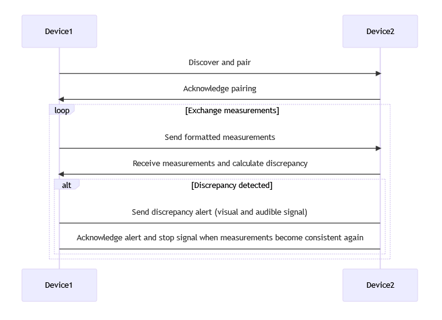

# Inclinometre
Projet Syst Embarqués

## Description

Le projet vise à développer un programme permettant de simuler un inclinomètre à double axe fonctionnant de manière distribuée. L’appareil considéré donne les valeurs du roulis et du tangage mesurées par le capteur associé. Le caractère distribué fait référence à une fonctionnalité supplémentaire de l’inclinomètre: plusieurs appareils peuvent être associés et échangent les mesures réalisées régulièrement. Le développement s’appuie sur la plateforme M5Stack Core Gray.

## Mécanisme d'association et d'échange de données

### Description
 
1. Chaque appareil est identifié par un identifiant unique l'adresse MAC de sa carte WiFi.
2. Chaque appareil est en attente de connexion.
3. Chaque seconde, les appareils envoient un message broadcast sur le réseau WiFi.
4. Une fois qu'un appareil reçoit un message broadcast, l'appareil envoie les informations suivantesen entier:
    - l'angle de roulis
    - l'angle de tangage
5. Si le TTL d'un appareil est dépassé, l'appareil est supprimé de la liste des appareils connectés

## Affichage de l'interface utilisateur

1. Afficher le resultat du Broadcast avec les adresses MAC
2. Quand il y a association :
- Affiche les adresses MAC de couleurs vertes 
- Affiche les valeurs des capteurs : Pitch et Roll
4. Afficher le resultat de la comparaison entre les valeurs des angles (Pitch et Roll) :
 - quand il y a un trop grand écart (défini préalablement), sorti d'un son spécifique Pitch et Roll + attribution d'une couleur
 - quand il n'y a pas d'écart important --> Affichage normal

